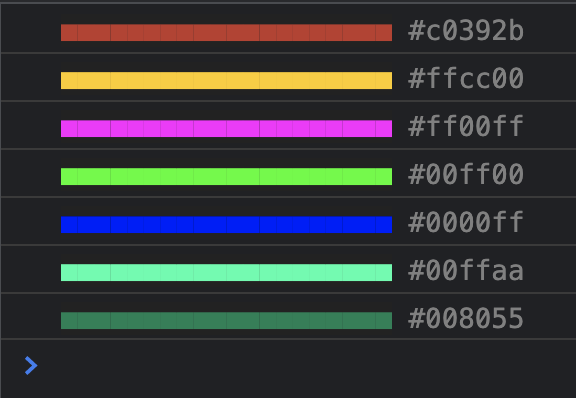

# p5.palette

A JavaScript library for color palette management in [p5.js](https://p5js.org/).


## Introduction

This library helps fast prototyping creative visual applications by providing functions to generate and manage color palettes.

It is strongly inspired by [colorLib](https://github.com/vormplus/colorLib) library for [Processing](https://processing.org/). 

p5.js missed something similar, so while converting some sketches from Processing (Java) to p5.js (JavaScript), I could neatly extract and migrate features from some hacks I had done in colorLib for personal usage, all joined in **p5.palette**.

The library allows you to create and manipulate color palettes in a very dynamic way, helping develop creative coding applications with color harmony and aesthetic appeal in a very fast pace.

## Installation

Please download the latest `p5.palette.min.js` release from the [lib](https://github.com/remistura/p5.palette/tree/main/lib) directory.

```html
<script type="text/javascript" src="path-to/p5.min.js"></script>
<script type="text/javascript" src="path-to/p5.palette.min.js"></script>
```

## Usage

The library provides a `Palette` class to used in p5.js, and each object instance represents a finite collection of colors.

The most basic way to create a Palette is:

```javascript
let palette;

function setup() {
    createCanvas(500, 500);
    palette = createPalette();
}

function draw() {
    ...use palette here
}
```

The palette object created is empty, it has no colors at the moment.
It is possible to add some colors to the palette:

```javascript
let palette;

function setup() {
    createCanvas(500, 500);
    palette = createPalette();
    palette
        .add(color("#c0392b"))
        .add(color(255, 204, 0))
        .add(color("magenta"))
        .add(color("#0f0"))
        .add(color("rgb(0,0,255)"))
        .add(color("hsl(160, 100%, 50%)"))
        .add(color("hsb(160, 100%, 50%)"));  
}

function draw() {
    ...use palette here
}
```

The `add()` function takes a p5.js [Color](https://p5js.org/reference/#/p5.Color) object and stores it into an internal array structure.

Each color added will have a numeric index, starting from zero.

Every Palette will have one of the colors selected at a time, and only one color can be selected. That color will be returned by the functions that deliver colors to be used by the application.

It is possible to easily visualize the colors in the palette using the `draw()` function:

```javascript
let palette;

function setup() {
  pixelDensity(1);
  createCanvas(400, 200);
  palette = createPalette();
  palette
    .add(color("#c0392b"))
    .add(color(255, 204, 0))
    .add(color("magenta"))
    .add(color("#0f0"))
    .add(color("rgb(0,0,255)"))
    .add(color("hsl(160, 100%, 50%)"))
    .add(color("hsb(160, 100%, 50%)"));  
}

function draw() {
  background(255);
  palette.draw();
  noLoop();
}
```

It will plot a rectangle for each color:


That is useful for inpecting the palette, but you might not want plotted in your sketch.

Yet another way to visualize the palette is through the `log()` function:

```javascript
let palette;

function setup() {
  pixelDensity(1);
  createCanvas(400, 200);
  palette = createPalette();
  palette
    .add(color("#c0392b"))
    .add(color(255, 204, 0))
    .add(color("magenta"))
    .add(color("#0f0"))
    .add(color("rgb(0,0,255)"))
    .add(color("hsl(160, 100%, 50%)"))
    .add(color("hsb(160, 100%, 50%)"));  
  palette.log();
}
```

The colors will be output on the browser console:

 